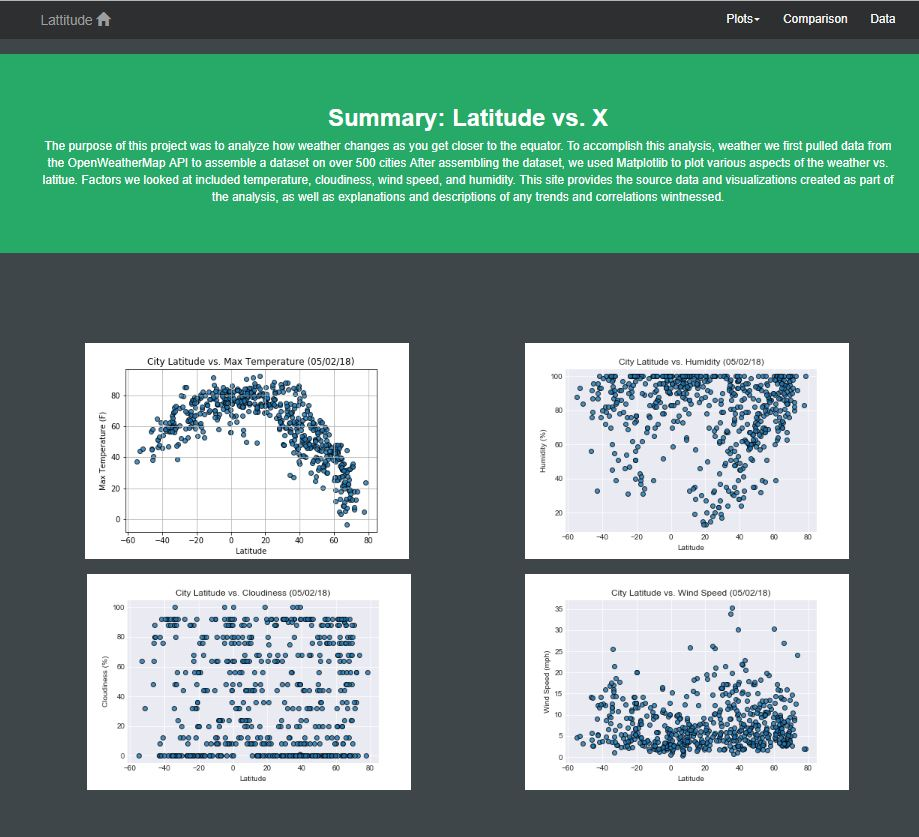

# USC Web Development Homework

Main Page:
- HW_index.html

This page contains all information about HW06 (PyWeather API).
Includes links on images and navigation bar to:
- HW_temperature.html: Graph Lattitude vs Temperature
- HW_humidity.html: Graph Lattitude vs Humidity %
- HW_cloudiness.html: Graph Lattitude vs Cloudiness %
- HW_wind_speed.html: Graph Lattitude vs Wind Speed
- HW_comparison.html: 4 graphs to compare all visualizations.
- HW_data.html: A table with all data required to plotting.

Contains layout based on Bootstrap, two css for main page and other pages and glyphicon to home page.
